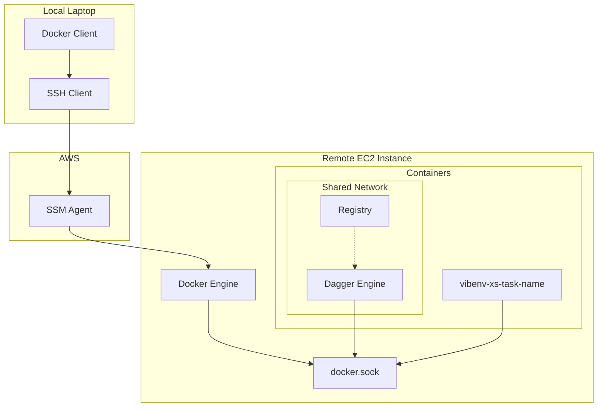

# vibenv

## Definition

A **vibenv** is a throw‑away, potentially cloud‑hosted, mini‑workspace that materializes instantly for a specific task, letting humans and AI agents collaborate safely and interactively, then vanish (or be reused) as needed.

## What makes something a vibenv?

* **Ephemeral & disposable:** spun up on demand; discarded or snapshotted when finished.
* **Hermetic safety zone:** fully isolated from the operator’s laptop and from other tasks.
* **Human‑agent co‑presence:** operator and AI agents share the same runtime and iterate in real time.
* **Near-instant startup:** provisioning targets an 'instant' feel (ideally < 5 s).
* **Task‑centric linking:** each vibenv is created around one discrete task/idea and can be reopened via a shareable link.
* **Parallelism by default:** multiple vibenvs can run concurrently without interference.
* **UI‑metaphor friendly:** maps naturally to Trello‑style cards or other kanban nodes.

## Cloud Development Environments (CDEs) – the foundation

> *CDEs are remote, pre‑configured browser workspaces, popularized by Gitpod in the late‑2010s and now mainstream via GitHub Codespaces—so the concept itself isn’t new.*

## Codex Code – a solo‑agent CDE (contrast)

* **What it is:** OpenAI’s *Codex Code* spins up a remote workspace, loads a repo, lets one agent hack for \~30 min, then hands back a diff.
* **Not collaborative:** the human waits for a batch result; no live co‑editing.
* **Slow to start:** environment provisioning typically takes 5‑10 minutes.
* **Not resumable:** once the run finishes, the workspace is torn down—can’t reopen it later.

→ *A **vibenv should** solve those pain points—by being collaborative/live, near‑instant to start, and fully resumable.*

## Rough

Some initial thoughts on the make up of the vm:

the dev environment is a stack of independent, swappable overlays:

1. **base** – a stripped-down OS image
2. **profile** – your dotfiles + shell helpers; essential cli tools; portable and updatable everywhere
3. **toolchain** – language/SDK layer (e.g., rustup + cargo) that can be refreshed without touching other layers
4. **project** – the specific repo’s source and deps
5. **session** – a throwaway scratch overlay per task, easily forked from any prior session

each layer can evolve on its own, and updates flow downward into any running stack without disturbing the layers above it.

## Architecture

**Local laptop:** docker client (connected to remote via SSH over SSM)

**Remote EC2 instance:** docker engine

- dagger engine: with the docker unix socket mounted: so we can reach the
  registry
- registry: localhost: 5000
- vibenv-task-name: this is running our dagger client: also has unix socket
  mounted to reach the dagger engine: we attach and dettach to this



## Setup

### Local Configuration

SSH over SSM - add to `~/.ssh/config`:

```
Host i-*
  ProxyCommand aws ssm start-session --target %h --document-name AWS-StartSSHSession --parameters "portNumber=%p"
  User root

  # SSH multiplexing for speed
  ControlMaster auto
  ControlPersist 10m
  ControlPath ~/.ssh/cm-%r@%h:%p

  # keep-alive settings
  TCPKeepAlive yes
  ServerAliveInterval 10
  ServerAliveCountMax 12
```

Docker context:

```nushell
let INSTANCE_ID = "i-your-instance-id-here"
docker context create dagger-ssm --docker $"host=ssh://($INSTANCE_ID)"
docker context use dagger-ssm
```

Verify with `docker context ls` - the active context shows with `*`.

### Remote Configuration

### Start the registry

```bash
docker run -d --name registry -p 127.0.0.1:5000:5000 registry:2
```

### Start the dagger engine

```bash
DAGGER_VERSION=$(dagger version | cut -d' ' -f2)
docker run -d --name dagger-engine-$DAGGER_VERSION \
  --network container:registry \
  --privileged \
  -v dagger-cache:/var/lib/dagger \
  -v /var/run/dagger:/run/dagger \
  registry.dagger.io/engine:$DAGGER_VERSION
```

The dagger engine shares the registry's network namespace so it can reach the
registry on localhost:5000.

### Test the setup

```bash
dagger -c 'container | from alpine | publish localhost:5000/t-1'
```

This should successfully publish an Alpine container to your local registry.

### Pull images to host Docker

After Dagger publishes images to the registry, pull them to the host Docker
engine:

```bash
docker pull localhost:5000/t-1
```

This makes images available to the host Docker daemon for running persistent
containers.

## Usage

### Create the launcher (one-time setup)

```nushell
use vibenv
vibenv create launcher
```

This builds and publishes the vibenv-launcher container to the registry.

### Launch persistent sessions

```nushell
use vibenv
vibenv launch my-task
```

This creates an ephemeral Docker container named `vibenv-my-task` that launches a persistent development session. The container automatically removes itself when the session ends, but your work is preserved in dagger cache volumes.

### Attach to active sessions

```nushell
use vibenv
vibenv attach my-task
```

This attaches to a currently running session. If no active session exists, you'll be prompted to launch a new one.

Or directly with Docker:
```bash
docker exec -it vibenv-my-task dtach -a /tmp/vibenv.sock
```

**Note**: Containers are ephemeral launchers - persistence comes from dagger cache volumes, not the containers themselves.

### Direct execution (legacy)

For the old behavior of direct dagger execution:

```nushell
use vibenv
vibenv remote-launch my-task
```
