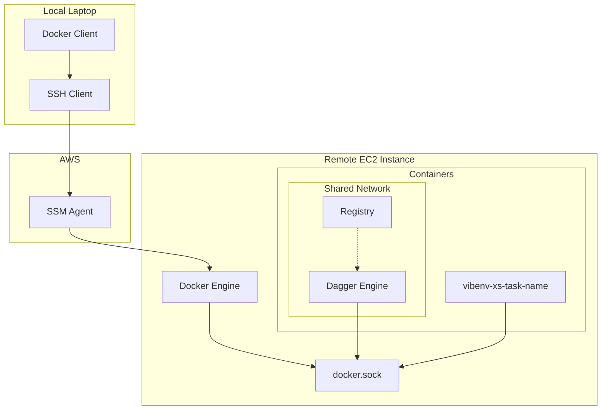

# vibenv

## Architecture

**Local laptop:** docker client (connected to remote via SSH over SSM)

**Remote EC2 instance:** docker engine

- dagger engine: with the docker unix socket mounted: so we can reach the
  registry
- registry: localhost: 5000
- vibenv-task-name: this is running our dagger client: also has unix socket
  mounted to reach the dagger engine: we attach and dettach to this



## Setup

### Local Configuration

SSH over SSM - add to `~/.ssh/config`:

```
Host i-*
  ProxyCommand aws ssm start-session --target %h --document-name AWS-StartSSHSession --parameters "portNumber=%p"
  User root

  # SSH multiplexing for speed
  ControlMaster auto
  ControlPersist 10m
  ControlPath ~/.ssh/cm-%r@%h:%p

  # keep-alive settings
  TCPKeepAlive yes
  ServerAliveInterval 10
  ServerAliveCountMax 12
```

Docker context:

```nushell
let INSTANCE_ID = "i-your-instance-id-here"
docker context create dagger-ssm --docker $"host=ssh://($INSTANCE_ID)"
docker context use dagger-ssm
```

Verify with `docker context ls` - the active context shows with `*`.

### Remote Configuration

### Start the registry

```bash
docker run -d --name registry -p 127.0.0.1:5000:5000 registry:2
```

### Start the dagger engine

```bash
DAGGER_VERSION=$(dagger version | cut -d' ' -f2)
docker run -d --name dagger-engine-$DAGGER_VERSION \
  --network container:registry \
  -v dagger-cache:/var/lib/dagger \
  -v /var/run/dagger:/run/dagger \
  registry.dagger.io/engine:$DAGGER_VERSION
```

The dagger engine shares the registry's network namespace so it can reach the
registry on localhost:5000.

### Test the setup

```bash
dagger -c 'container | from alpine | publish localhost:5000/t-1'
```

This should successfully publish an Alpine container to your local registry.

### Pull images to host Docker

After Dagger publishes images to the registry, pull them to the host Docker
engine:

```bash
docker pull localhost:5000/t-1
```

This makes images available to the host Docker daemon for running persistent
containers.

## Usage

### Create the launcher (one-time setup)

```nushell
use vibenv
vibenv create launcher
```

This builds and publishes the vibenv-launcher container to the registry.

### Launch persistent sessions

```nushell
use vibenv
vibenv launch my-task
```

This creates a persistent Docker container named `vibenv-my-task` with a detached session that survives connection drops.

### Attach to sessions

```nushell
use vibenv
vibenv attach my-task
```

Or directly with Docker:
```bash
docker exec -it vibenv-my-task dtach -a /tmp/vibenv.sock
```

### Direct execution (legacy)

For the old behavior of direct dagger execution:

```nushell
use vibenv
vibenv remote-launch my-task
```
